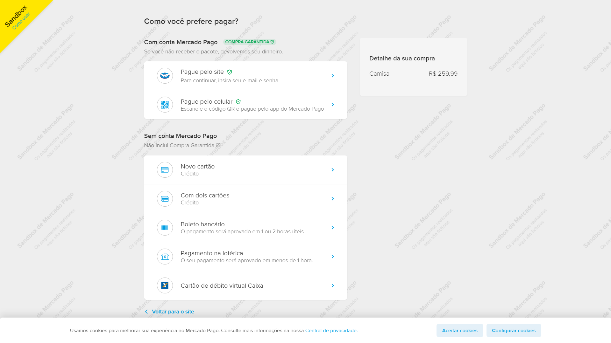

# Estudos de API com o [Mercado Pago](https://www.mercadopago.com.br/developers/pt/reference) e [Hashtag Programação](https://www.youtube.com/@HashtagProgramacao)

Pequeno projeto de um Ecommerce, a página de pagamento será realizada no site do Mercado Pago, com duas opções no final caso a compra tenha dado certa ou errada.

 

## Built With

O projeto foi realizado com as seguintes tecnologias.

   <ul>
      <li></li>
      <li></li>
      <li></li>
      <li></li>
   </ul>

    

   ## O que é o SDK?
   
Um kit de desenvolvimento de software (SDK) é um conjunto de ferramentas de criação específicas da plataforma para desenvolvedores. Você precisa de componentes como depuradores, compiladores e bibliotecas para criar código que seja executado em uma plataforma, sistema operacional ou linguagem de programação específica.

   
<b>Diferença de API's e SDK</b>: Você usa APIs quando deseja acessar a funcionalidade escrita por outro desenvolvedor por meio de uma interface adequada. Você usa um SDK quando quer ferramentas específicas da plataforma para escrever código com mais rapidez. Em vez de escolher entre uma API ou um SDK, você pode usar os dois ao desenvolver software.

    

   ## Como é visualizado a página de compra

   

